# 🌊 Vibly System Flow & Architecture

Welcome to the **Vibly** system documentation. This document provides a high-level and detailed view of how the platform operates, from the moment a streamer goes live to the moment a viewer interacts via chat.

---

## 🚀 The Big Picture

Vibly is a **real-time media pipeline** integrated with a **persistent communication layer**.

```mermaid
graph TD
    %% Roles
    Streamer["🎥 Streamer (OBS)"]
    Viewer["📺 Viewer (Browser)"]

    %% Media Flow
    subgraph Media Pipeline
        Ingest["🛠️ Ingest Server (Go)"]
        WorkerPool["🧵 Worker Pool"]
        FFmpeg["🎞️ FFmpeg Process"]
        Storage["💾 HLS & MP4 Storage"]
    end

    %% Communication Flow
    subgraph Interaction Layer
        WS["🔌 WebSocket Server"]
        ChatPersist["🗄️ Chat Store (JSON)"]
    end

    %% Connections
    Streamer -->|RTMP + Stream Key| Ingest
    Ingest -->|Job Assignment| WorkerPool
    WorkerPool -->|Spawn| FFmpeg
    FFmpeg -->|TS Segments / Master Playlist| Storage
    Streamer -->|Real-time Events| WS
    Viewer -->|Watch HLS| Storage
    Viewer <-->|Bi-directional Chat| WS
    WS <-->|Load/Save| ChatPersist
```

---

## 1. Streamer Lifecycle (The Source)

### A. Authentication & Ingestion

1.  **Identity**: Streamer logs in, gets their **JWT** and **Stream Key** (`live_xxxx`).
2.  **Handshake**: OBS pushes RTMP to `rtmp://vibly/live`.
3.  **Validation**: The Ingest server validates the key. If valid, it assigns a **Worker**.

### B. Worker Isolation & Processing

- **Isolation**: One OS process per stream. If one streamer's FFmpeg crashes, the rest remain active.
- **Transcoding (ABR)**: FFmpeg converts input to:
  - `1080p` (High)
  - `720p` (Mid)
  - `480p` (Low)
- **Artifacts**:
  - `index.m3u8`: The Master Playlist.
  - `recording.mp4`: Full local archive.
  - `thumb.jpg`: Automated snapshots.

---

## 2. Viewer Lifecycle (The Consumer)

### A. Playback Experience

- Viewers access the channel. The player (HLS.js/Video.js) polls the `index.m3u8`.
- Bandwidth-aware switching ensures no buffering (ABR).

### B. Integrated Interaction (Chat)

- Viewers connect to `ws://vibly/ws/chat?channelID=xxx`.
- **Flow**:
  1.  **History**: On connect, API fetches last 50 messages from `data/chat_{channelID}.json`.
  2.  **Real-time**: Messages are broadcast to everyone in the channel.
  3.  **Replies**: Structured metadata allows "threading" (relying to a specific message ID).

---

## 3. Persistent Data Model

| Entity    | Storage            | Key Fields                           |
| :-------- | :----------------- | :----------------------------------- |
| **User**  | `users.json`       | `id`, `email`, `stream_key`          |
| **Chat**  | `chat_{id}.json`   | `id`, `parent_id`, `content`, `type` |
| **Media** | `data/media/{id}/` | `.m3u8`, `.ts`, `.mp4`, `.jpg`       |

---

## 4. System Guarantees

- **Stateless Chat**: The backend manages WebSocket connections dynamically; if the server restarts, users reconnect and history is reloaded from disk.
- **Resource Capping**: The worker pool ensures FFmpeg doesn't consume 100% CPU, preventing server lockout.
- **Portfolio Worthy**: Demonstrates mastery over OS processes, binary stream handling, and real-time state synchronization.
